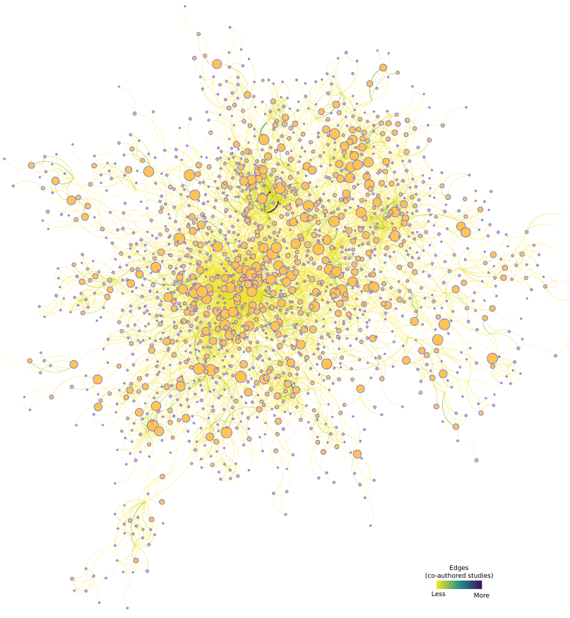

# Hema-AuthNet – v1.0

### Thanks for your interest in using Hem-AuthNet.

Hemophilia is a relatively rare hereditary coagulation disorder, caused by the synthesis of defective Factor VIII or Factor IX proteins. This condition impairs the coagulation cascade, and if left untreated, causes permanent joint damage and poses a risk of fatal intracranial hemorrhage in case of traumatic events. In its severe form, patients who have access to supportive health care systems can benefit from prophylactic treatment, which consists of regular life-long administrations of recombinant forms of the FVIII or the FIX proteins.

We used sophisticated computational techniques to map the hemophilia literature of the last 60 years. We created a network structure to represent authorship collaborations, where the nodes are the researchers and 2 nodes are connected if they co-authored a manuscript. Overall, this study serves as a historical appreciation of the effort of thousands of hemophilia researchers and demonstrates that a computational framework is able to automatically identify collaboration networks and their research specialties.

Here you will find the datasets and the source code used in the manuscript “Computational Analyses Reveal Fundamental Properties of the Hemophilia Literature in the Last 6 Decades”, by Tiago Lopes, Ricardo Rios and Tatiane Nogueira (Bioinformatics and Biology Insights, 2022).

The organization of the material is:

> - **/dataset** - contains the datasets to reproduce our findings and create the figures.
> - **/results** - some preprocessed files with abstracts and networks.
> - **/src** - contains the source code for the Hem-AuthNet framework.
> - **/workdir** - Many paths are hard-coded, so please execute all code from within this directory. 

Moreover, please notice that some files were too big to be uploaded to the repository (eg, the Medline results with the ~20,000 abstracts), hence, you will need to search Pubmed and download it by yourself.

If you find any issues with the code, please contact us: tiago-jose@ncchd.go.jp, ricardoar@ufba.br, tatiane.nogueira@ufba.br

On the behalf of all of the authors, we appreciate your interest in Hem-AuthNet and hope it is useful to your research.

